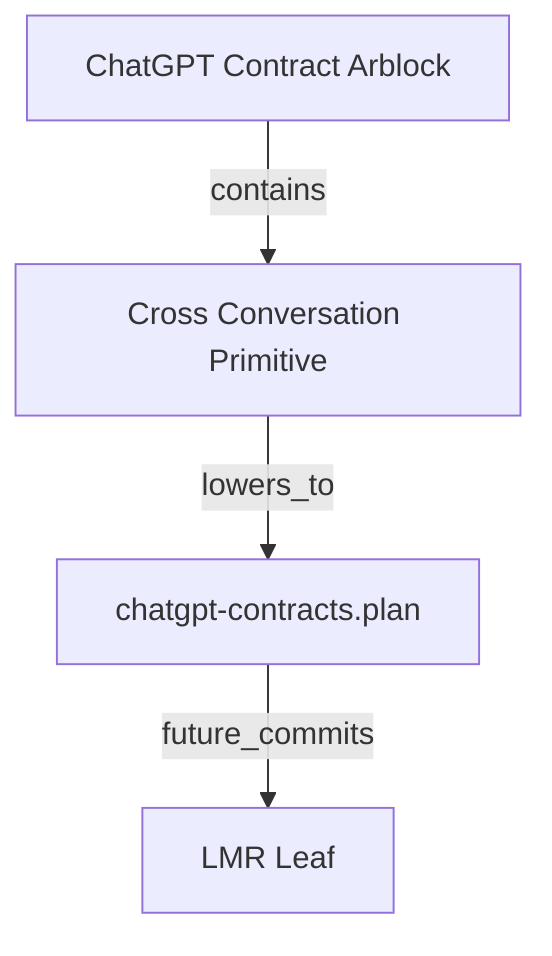
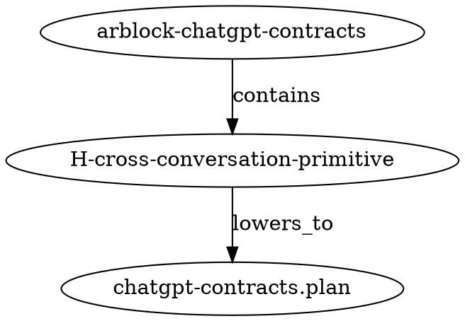

# Visual Graph Grammar Profile

Profile identity: `loci.chatgpt.visual_graph_grammar.v0`

Status: local profile draft

Purpose: let one typed contract emit docs, specs, proofs, plans, and visuals from one shared graph-shaped source.

## Core stance

D3 should be an output target, not the root grammar.

The root should be a compact contract graph IR that can lower into multiple views:

```text
ContractGraph IR
  ├─ docs / markdown
  ├─ specs / schema
  ├─ proofs / proof obligations
  ├─ .plan / Yata handoff
  ├─ D3 / interactive graph JSON
  ├─ Mermaid / quick docs diagrams
  └─ DOT / static graph tooling
```

This keeps the contract source stable while allowing different renderers and consumers.

## Why not D3 as root?

D3 is excellent for visualizing force graphs, DAGs, hierarchies, timelines, and interactive exploration.

But D3 JSON should not own the semantics because:

- D3 is a renderer/library surface, not the canonical contract model
- visual layout metadata can pollute semantic graph identity
- non-visual consumers need the same graph without browser assumptions
- proof and plan emitters need deterministic semantic fields, not visual coordinates

So D3 is a projection.

## Root object: ContractGraph

Conceptual shape:

```json
{
  "kind": "loci.contract_graph",
  "version": "v0",
  "graph_id": "loci.chatgpt.contract_arblock.v0",
  "source_locus": "loci/chatgpt",
  "material_hash": "pending",
  "nodes": [],
  "edges": [],
  "views": [],
  "emissions": []
}
```

## Node classes

Recommended node classes:

```text
contract       = composed contract or blueprint
hole           = typed Yata hole
spec           = canonical or local spec document
plan           = `.plan` wire/projection
proof          = proof obligation or proof artifact
visual         = visual projection artifact
membrane       = cross-locus boundary/passport
arblock        = bounded sealed work unit
arbit          = witness/proof/seal reference
arbyte         = quorum summary
lmr_leaf       = Loci Mountain Range leaf
lmr_root       = Loci Mountain Range root
store_artifact = OCI/Kyozo artifact
agent          = ChatGPT/Codex/Claude/Gemini/human/tool posture
```

## Edge classes

Recommended edge classes:

```text
emits          = source contract emits artifact
lowers_to      = semantic object lowers to concrete surface
proves         = proof discharges obligation
witnesses      = witness/seal observes material
contains       = arblock contains hole/artifact
supersedes     = successor replaces prior sealed object
references     = non-owning reference
crosses        = membrane crossing
stores_as      = object stored as Kyozo/OCI artifact
commits        = LMR leaf/root commits subject
routes_to      = work dispatch or handler route
```

## Minimal node schema

```json
{
  "id": "H-cross-conversation-primitive",
  "class": "hole",
  "label": "Cross Conversation Primitive",
  "locus": "loci/chatgpt",
  "anchor": "loci/chatgpt/CROSS_CONVERSATION_PRIMITIVE.md",
  "state": "open",
  "material_hash": "pending",
  "tags": ["yata", "conversation", "codex"],
  "meta": {}
}
```

## Minimal edge schema

```json
{
  "id": "edge-contracts-plan-contains-cross-conv",
  "class": "contains",
  "source": "arblock-chatgpt-contracts",
  "target": "H-cross-conversation-primitive",
  "label": "contains typed hole",
  "state": "active",
  "meta": {}
}
```

## Emission model

One contract may emit multiple artifact families.

```text
contract
  emits spec
  emits docs
  emits proof obligations
  emits visual graph
  emits Yata plan
  emits LMR subject material
```

This emission relationship should be represented as graph edges, not hidden in prose.

## D3 projection

D3 projection should produce:

```json
{
  "nodes": [
    {
      "id": "H-cross-conversation-primitive",
      "group": "hole",
      "label": "Cross Conversation Primitive",
      "state": "open",
      "anchor": "loci/chatgpt/CROSS_CONVERSATION_PRIMITIVE.md"
    }
  ],
  "links": [
    {
      "source": "arblock-chatgpt-contracts",
      "target": "H-cross-conversation-primitive",
      "type": "contains"
    }
  ]
}
```

D3-specific layout fields such as `x`, `y`, `fx`, `fy`, `radius`, or color should remain optional view metadata and must not affect semantic hashes.

## Mermaid projection

Mermaid projection can provide quick markdown-native visualization:



## DOT projection

DOT projection is useful for static graph tooling:



## Hashing rule

Semantic material hash should include:

- graph kind/version
- node ids/classes/anchors/states
- edge ids/classes/source/target/state
- emission declarations

Semantic material hash should exclude:

- visual coordinates
- renderer-specific colors
- transient UI state
- zoom/pan/viewport settings

## Relationship to Yata

Yata holes should become graph nodes.

Yata dependencies, provenance, selected candidates, and move-out relationships should become edges.

A `.plan` remains the compact handoff surface; the graph IR is the richer multi-output emission source.

## Relationship to arblock

An arblock should be able to emit a graph view of itself.

Local convention:

```text
arblock/<name>.graph.json      canonical ContractGraph IR
arblock/<name>.d3.json         D3 projection
arblock/<name>.mermaid.md      Mermaid projection
arblock/<name>.proofs.md       proof obligations
arblock/<name>.plan            Yata plan
```

## Relationship to LMR/Kyozo

The ContractGraph IR can become the subject of an LMR leaf.

Renderer projections may be stored as layers or referrers, but the semantic graph IR should be the committed subject when visual graph identity matters.

## Typed hole

```text
hole_id: H("visual-graph-grammar" ++ "loci/chatgpt" ++ "v0.2")
anchor: loci/chatgpt/VISUAL_GRAPH_GRAMMAR_PROFILE.md
state: open
expected_type: multi-output graph emission contract
```

Invariants:

- D3 is an output target, not canonical root semantics.
- One contract can emit docs, specs, proofs, plans, and visual projections.
- Semantic hashes exclude renderer/layout state.
- Yata holes and arblock relationships are representable as graph nodes/edges.
- Graph IR can become an LMR leaf subject.

Candidate outputs:

- this profile
- one example ContractGraph JSON for `chatgpt-contracts`
- one D3 projection JSON
- one Mermaid projection
- optional future model support

Verification:

- `chatgpt-contracts` arblock can be represented as ContractGraph IR
- generated D3 JSON has nodes/links only
- `.plan` entries and graph nodes agree on hole identities

Move-out target:

```text
loci/chatgpt first; docs/ after one working graph emission
```

Seal condition:

```text
ContractGraph IR material hash is committed by an LMR leaf or referenced by arblock plan
```
