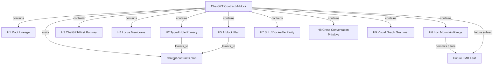

# ChatGPT Contracts Graph — Mermaid Projection

```mermaid
graph TD
  A[ChatGPT Contract Arblock] -->|emits| P[chatgpt-contracts.plan]
  A -->|contains| H1[H1 Root Lineage]
  A -->|contains| H2[H2 Typed Hole Primacy]
  A -->|contains| H3[H3 ChatGPT-First Runway]
  A -->|contains| H4[H4 Locus Membrane]
  A -->|contains| H5[H5 Arblock Plan]
  A -->|contains| H6[H6 Loci Mountain Range]
  A -->|contains| H7[H7 SLL / Dockerfile Parity]
  A -->|contains| H8[H8 Cross Conversation Primitive]
  A -->|contains| H9[H9 Visual Graph Grammar]

  H2 -->|lowers_to| P
  H5 -->|lowers_to| P
  H6 -->|commits future| L[Future LMR Leaf]
  A -->|future subject| L
```
