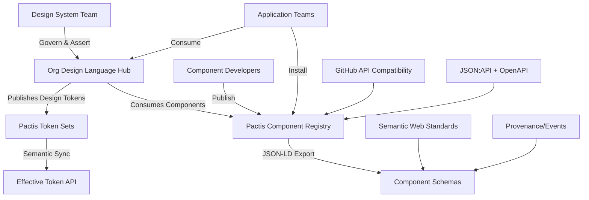
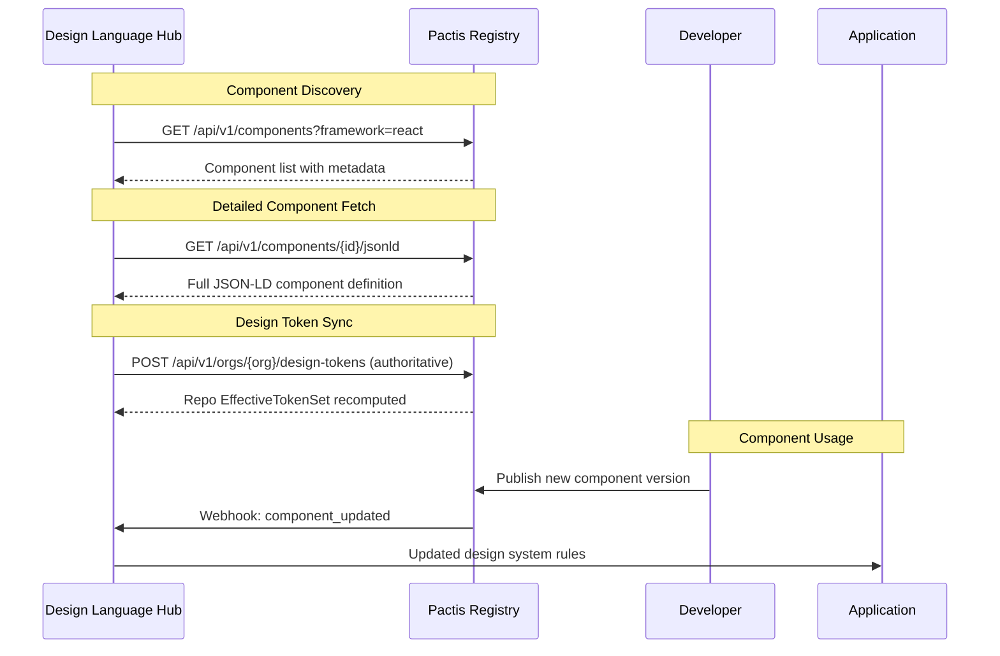

# Design Language Hub ↔ Pactis Integration Specification

Owner: Pactis Core • Mode: Design/Brainstorm → Source-of-Truth Pipeline

## Executive Summary

This document specifies the integration between Pactis (Conversation-Driven Framework Manager) and the Design Language Hub, establishing Pactis as the source of truth for component implementations while the Design Language Hub governs design system rules and tokens.

**Integration Vision**: Create a symbiotic relationship where:
- **Pactis** = Component implementation and distribution ("lol" - language of love)
- **Design Language Hub** = Design governance and token management

We formalize this as a Source‑of‑Truth workflow across a Semantic Truth Mesh:
- Organizations own a Design Language Hub (policy, tokens, rules)
- Repositories derive an Effective Token Set from their organization
- Components are implemented in Pactis and validated against the effective rules
- Provenance is captured for all assertions (who/what/when) and exposed via JSON‑LD

## 🏗️ System Architecture Overview



## 🔗 Integration Points

This section reflects the target pipeline and alignment with the current Pactis architecture. Where applicable, Pactis already exports/accepts JSON‑LD with stable `@id`/`@type` identifiers. See also: SEMANTIC_ALIGNMENT.md and jsonld/pactis.context.jsonld.

### 1. **Component Discovery & Consumption**

#### Primary Endpoint: Component JSON-LD Export
```http
GET /api/v1/components/{id}/jsonld
Content-Type: application/ld+json
```

**Response Structure:**
```json
{
  "@context": {
    "@vocab": "https://pactis.dev/vocab/",
    "ash": "https://ash-hq.org/",
    "semver": "https://semver.org/",
    "prov": "http://www.w3.org/ns/prov#"
  },
  "@id": "pactis:terminal-ui-component",
  "@type": "AshResource",
  "name": "Terminal UI Component",
  "version": "2.1.0",
  "description": "Beautiful terminal interface component...",
  "designTokenSet": "pactis:token-sets/org-123/v3",
  "validatedAgainst": [
    {"rule": "pactis:policy/color-contrast", "status": "passed"},
    {"rule": "pactis:policy/spacing-scale", "status": "warning"}
  ],
  "provenance": {
    "prov:wasGeneratedBy": "pactis:build/abcdef",
    "prov:generatedAtTime": "2025-09-19T12:34:56Z"
  },
  "resource": {
    "attributes": [...],
    "actions": [...],
    "relationships": [...]
  },
  "quality": {
    "score": 4.5,
    "testCoverage": 85
  },
  "stats": {
    "downloads": 1847,
    "stars": 156,
    "forks": 23
  }
}
```

#### Component Search & Discovery
```http
GET /api/v1/components?framework=react&category=ui&verified_only=true
```

#### Component Download with Framework Generation
```http
POST /api/v1/components/{id}/download
{
  "framework": "react",
  "options": {
    "include_tests": true,
    "typescript": true
  }
}
```

### 2. **Bulk Synchronization Strategies**

#### JSON-LD Library Bundle Download
```http
GET /jsonld/library/download
Content-Type: application/x-tar
```
Downloads complete schema library bundle for offline processing.

#### Ash JSON:API Integration
```http
GET /api/json/blueprints
GET /api/v1/openapi.json
```
Programmatic access to all components via standardized JSON:API.

#### Org/Repo Token Endpoints (Design Language)

These endpoints model org‑level token authority and repo‑level derivation. The DLH is expected to own org token sets; repos may propose scoped overrides.

```http
# Create or update org token set (JSON‑LD)
POST /api/v1/orgs/{org_id}/design-tokens
Content-Type: application/ld+json

# Retrieve pinned token set by version
GET /api/v1/orgs/{org_id}/design-tokens/{version}

# Get repo-effective token set (org ∪ allowed overrides)
GET /api/v1/repos/{owner}/{repo}/effective-design-tokens

# Propose repo-scoped overrides (validated against policy)
POST /api/v1/repos/{owner}/{repo}/design-tokens
Content-Type: application/ld+json
```

### 3. **Real-time Updates**

#### Webhook Integration
```elixir
# Pactis publishes events via Phoenix.PubSub
Phoenix.PubSub.broadcast(
  Pactis.PubSub,
  "repository:#{workspace_id}",
  {:component_updated, %{component_id: id, ...}}
)
```

#### GitHub-Compatible Repository Events
```http
POST /api/v1/repos/{owner}/{repo}/hooks
{
  "name": "web",
  "config": {
    "url": "https://design-hub.example.com/webhooks/pactis",
    "content_type": "json"
  },
  "events": ["push", "release", "star"]
}
```

## 🔄 Synchronization Architecture

### Data Flow Diagram



### Bidirectional Sync Strategy

#### 1. **Pull Model (Recommended Start)**
- Design Language Hub polls Pactis every 15 minutes
- Incremental sync based on `updated_at` timestamps
- Checksum validation for data integrity

#### 2. **Push Model (Real-time)**
- Pactis publishes webhooks on component changes
- Design Language Hub subscribes to relevant events
- Retry mechanism with exponential backoff

#### 3. **Hybrid Model (Production)**
- Combination of webhooks for real-time updates
- Scheduled bulk sync for consistency checks
- Event sourcing for audit trail

### Provenance & Mesh

- All token sets, component releases, and validations produce provenance events
- JSON‑LD includes `prov:*` metadata for who/what/when
- Pactis maintains a semantic index (SQL-backed graph) for queries like:
  - “which components were built against token set v3?”
  - “which repos are out-of-date after org token change?”
  - “show conflicts resolved in the last 7 days”

## 📋 Integration Implementation Plan

### Phase 1: Basic Component Consumption (Week 1-2)

**Goal**: Design Language Hub can discover and consume Pactis components

**Tasks**:
1. Implement Pactis API client in Design Language Hub
2. Create component import pipeline for JSON-LD format
3. Map Pactis component metadata to Design Language Hub schema
4. Build basic search and filtering capabilities

**Success Criteria**:
- [ ] Can fetch component list from Pactis
- [ ] Can import individual components via JSON-LD
- [ ] Components display correctly in Design Language Hub UI
- [ ] Basic metadata mapping is functional

### Phase 2: Design Token Integration (Week 3-4)

**Goal**: Bidirectional synchronization of design tokens

**Tasks**:
1. Define design token exchange format (JSON‑LD) with scopes
2. Implement org‑authoritative token publishing (DLH → Pactis)
3. Compute Repo EffectiveTokenSet and bind in component metadata
4. Implement conflict detection/resolution workflow with events

**Success Criteria**:
- [ ] Tokens flow from DLH (org) → Pactis (authoritative)
- [ ] Repos expose EffectiveTokenSet and validate on publish
- [ ] Token versioning, rollback, and pinning supported
- [ ] Conflicts are captured as events with resolution outcomes

### Phase 3: Real-time Synchronization (Week 5-6)

**Goal**: Live updates between systems

**Tasks**:
1. Implement webhook endpoints in Design Language Hub
2. Configure Pactis to publish component change events
3. Build event processing and conflict resolution
4. Add monitoring and error handling

**Success Criteria**:
- [ ] Real-time component updates flow to Design Language Hub
- [ ] Webhook delivery is reliable with retry logic
- [ ] System handles high-frequency updates gracefully
- [ ] Comprehensive error monitoring and alerting

### Phase 4: Advanced Features (Week 7-8)

**Goal**: Production-ready integration with advanced capabilities

**Tasks**:
1. Implement component dependency tracking
2. Add support for component versioning and rollbacks
3. Build analytics and usage tracking integration
4. Create administrative interfaces for integration management

**Success Criteria**:
- [ ] Component dependencies are tracked and resolved
- [ ] Version management works across both systems
- [ ] Usage analytics provide insights into component adoption
- [ ] Admin tools allow fine-grained integration control

## 🔧 Technical Implementation Details

### Governance Model (Scopes & Policy)

- Token scopes:
  - `locked` (org‑only; cannot be overridden)
  - `overridable` (repo may propose within constraints)
  - `hint` (component-level annotation; informative)
- Policy rules (examples):
  - Color contrast, spacing scale, typographic rhythm, motion duration caps
- Validation pipeline:
  1) Resolve EffectiveTokenSet (Org ∪ Allowed Repo Overrides)
  2) Run rule checks against component assets
  3) Emit validation records and provenance entries

### Versioning & Pinning

- Org token sets are versioned and content‑hashed
- Repo EffectiveTokenSet includes `{org_version, repo_overrides_hash}`
- Components record `designTokenSet` they were built against for reproducibility

### Conflict Handling

- Conflicts arise when repo overrides violate scope/policy or drift exists
- Represent conflicts as events with states: `detected → reviewed → resolved`
- Resolution strategies: server‑wins/rollback, targeted override, human approval

### Authentication & Authorization

```elixir
# Pactis API Key Authentication
config :pactis_client,
  api_key: System.get_env("PACTIS_API_KEY"),
  workspace_id: System.get_env("PACTIS_WORKSPACE_ID"),
  base_url: "https://pactis.dev"
```

**Required Scopes**:
- `read:components` - Component discovery and metadata
- `read:repositories` - Repository access for code generation
- `write:design-tokens` - Design token publishing (if implemented)

### Data Transformation Pipeline

```typescript
// Design Language Hub Integration Service
class CDFMIntegrationService {
  async syncComponents(): Promise<SyncResult> {
    // 1. Fetch updated components from Pactis
    const components = await this.cdfmClient.getComponents({
      updated_since: this.lastSyncTime,
      framework: ['react', 'vue', 'svelte']
    });

    // 2. Transform Pactis JSON-LD to Design Language Hub format
    const transformedComponents = components.map(this.transformComponent);

    // 3. Upsert components in Design Language Hub
    const results = await Promise.allSettled(
      transformedComponents.map(comp => this.designHub.upsertComponent(comp))
    );

    // 4. Update sync timestamp and return results
    this.lastSyncTime = Date.now();
    return this.aggregateResults(results);
  }

  private transformComponent(cdfmComponent: CDFMComponent): DLHComponent {
    return {
      id: cdfmComponent['@id'],
      name: cdfmComponent.name,
      version: cdfmComponent.version,
      framework: this.detectFramework(cdfmComponent),
      designTokens: this.extractDesignTokens(cdfmComponent),
      metadata: {
        source: 'pactis',
        originalId: cdfmComponent.id,
        qualityScore: cdfmComponent.quality?.score,
        downloads: cdfmComponent.stats?.downloads
      }
    };
  }
}
```

### Error Handling & Resilience

```typescript
// Retry Strategy with Exponential Backoff
class ResilientCDFMClient {
  async fetchWithRetry<T>(operation: () => Promise<T>): Promise<T> {
    const maxRetries = 3;
    const baseDelay = 1000;

    for (let attempt = 1; attempt <= maxRetries; attempt++) {
      try {
        return await operation();
      } catch (error) {
        if (attempt === maxRetries) throw error;

        const delay = baseDelay * Math.pow(2, attempt - 1);
        await this.sleep(delay);

        console.warn(`Pactis API attempt ${attempt} failed, retrying in ${delay}ms:`, error);
      }
    }
  }
}
```

## 📊 Data Models & Schemas

### Component Mapping Schema

```json
{
  "$schema": "http://json-schema.org/draft-07/schema#",
  "title": "Pactis to Design Language Hub Component Mapping",
  "type": "object",
  "properties": {
    "cdfmId": {"type": "string", "format": "uuid"},
    "dlhId": {"type": "string"},
    "mappingVersion": {"type": "string"},
    "transformationRules": {
      "type": "object",
      "properties": {
        "nameMapping": {"type": "string"},
        "metadataExtraction": {"type": "array"},
        "designTokenMapping": {"type": "object"}
      }
    },
    "lastSynced": {"type": "string", "format": "date-time"},
    "syncStatus": {"enum": ["success", "partial", "failed"]},
    "conflicts": {"type": "array"}
  }
}
```

### Design Token Exchange Format

```json
{
  "@context": {
    "@vocab": "https://design-tokens.org/vocab/",
    "pactis": "https://pactis.dev/schema",
    "prov": "http://www.w3.org/ns/prov#"
  },
  "@type": "DesignTokenCollection",
  "version": "1.0.0",
  "tokens": {
    "color": {
      "primary": {
        "value": "#007bff",
        "type": "color",
        "description": "Primary brand color",
        "scope": "locked"
      }
    },
    "spacing": {
      "base": {
        "value": "1rem",
        "type": "dimension",
        "scope": "overridable",
        "constraints": {"min": "0.5rem", "max": "2rem", "step": "0.25rem"}
      }
    }
  },
  "metadata": {
    "source": "design-language-hub",
    "orgId": "org-123",
    "targetComponents": ["button", "card", "modal"],
    "prov:generatedAtTime": "2025-09-19T12:00:00Z"
  }
}
```

## 🔍 Monitoring & Analytics

### Key Metrics to Track

```typescript
interface IntegrationMetrics {
  // Sync Performance
  syncLatency: number;           // Average sync time
  syncSuccess: number;           // Successful sync percentage
  syncFrequency: number;         // Syncs per hour

  // Component Usage
  componentsDiscovered: number;  // New components found
  componentsImported: number;    // Successfully imported
  componentsFailed: number;      // Import failures

  // Design Token Sync
  tokensPublished: number;       // Tokens sent to Pactis
  tokensConsumed: number;        // Tokens received from Pactis
  tokenConflicts: number;        // Resolution conflicts

  // System Health
  apiAvailability: number;       // Pactis API uptime
  webhookDelivery: number;       // Webhook success rate
  errorRate: number;             // Overall error percentage
}
```

### Monitoring Dashboard Requirements

1. **Real-time sync status** - Current sync state and last successful sync
2. **Component inventory** - Total components, by framework, by status
3. **Error tracking** - Failed syncs, API errors, transformation failures
4. **Performance metrics** - Sync duration, API response times, throughput
5. **Design token analytics** - Token usage, conflicts, version history

## 🚀 Deployment Strategy

### Development Environment

```yaml
# docker-compose.dev.yml
version: '3.8'
services:
  design-language-hub:
    build: .
    environment:
      PACTIS_API_KEY: dev_key_123
      PACTIS_WORKSPACE_ID: dev_workspace
      PACTIS_BASE_URL: http://localhost:4000
      SYNC_INTERVAL: 60  # 1 minute for dev
    depends_on:
      - pactis pactis:
    image: pactis:latest
    ports:
      - "4000:4000"
    environment:
      DATABASE_URL: postgres://...
      SECRET_KEY_BASE: dev_secret
```

### Production Considerations

1. **Rate Limiting**: Respect Pactis API rate limits (configured per workspace)
2. **Caching**: Implement Redis cache for frequently accessed components
3. **Security**: Use workspace-scoped API keys with minimal required permissions
4. **Scaling**: Horizontal scaling with leader election for sync coordination
5. **Backup**: Regular backups of mapping data and sync state

## 🛡️ Security & Privacy

### API Security

- **Authentication**: Workspace-scoped API keys with rotation capability
- **Authorization**: Granular permissions per integration operation
- **Transport**: TLS 1.3 for all API communications
- **Rate Limiting**: Per-workspace limits with burst capacity
- **Audit Logging**: Complete audit trail of all integration operations

### Multi‑Tenant Boundaries

- Org‑scoped tokens cannot leak across workspaces
- Repo EffectiveTokenSet is computed within org boundary unless explicitly federated
- Webhook subscriptions are per‑org; delivery includes org context

## 🧭 Current State vs. Roadmap

- Pactis already exports JSON‑LD for components and supports webhook patterns
- This document codifies the org → repo token inheritance and provenance model
- Next steps (implementation):
  - Add org/repo token endpoints and EffectiveTokenSet computation APIs
  - Persist validation and provenance events, and include IDs in JSON‑LD exports
  - Expose a simple graph query (SQL-backed) for impact analysis after token changes

### Data Privacy

- **Component Metadata**: Only public component data is synchronized
- **User Data**: No user PII is shared between systems
- **Workspace Isolation**: Strict workspace boundaries prevent data leakage
- **Retention**: Configurable data retention policies for sync history

## 🧪 Testing Strategy

### Integration Test Suite

```typescript
describe('Pactis Integration', () => {
  describe('Component Sync', () => {
    it('should sync new components from Pactis', async () => {
      // Arrange
      const mockComponent = createMockCDFMComponent();
      cdfmMock.setup(GET('/api/v1/components')).returns([mockComponent]);

      // Act
      const result = await integrationService.syncComponents();

      // Assert
      expect(result.imported).toBe(1);
      expect(designHub.getComponent(mockComponent.id)).toBeDefined();
    });

    it('should handle API failures gracefully', async () => {
      // Arrange
      cdfmMock.setup(GET('/api/v1/components')).throws(new Error('API Error'));

      // Act & Assert
      await expect(integrationService.syncComponents()).rejects.toThrow();
      expect(metrics.errorRate).toBeGreaterThan(0);
    });
  });

  describe('Design Token Sync', () => {
    it('should publish design tokens to Pactis', async () => {
      // Test design token publishing
    });

    it('should resolve token conflicts', async () => {
      // Test conflict resolution
    });
  });
});
```

### Load Testing

```typescript
// Performance test scenarios
describe('Performance Tests', () => {
  it('should handle 1000 components sync within 30 seconds', async () => {
    const components = generateMockComponents(1000);
    cdfmMock.setup(GET('/api/v1/components')).returns(components);

    const startTime = Date.now();
    await integrationService.syncComponents();
    const duration = Date.now() - startTime;

    expect(duration).toBeLessThan(30000);
  });
});
```

## 📈 Success Metrics

### Technical KPIs

- **Sync Reliability**: >99% successful sync operations
- **Sync Performance**: <5 second average sync time for incremental updates
- **API Availability**: >99.9% Pactis API availability
- **Error Recovery**: <1 minute recovery time from transient failures

### Business KPIs

- **Component Adoption**: Increased usage of Pactis components in applications
- **Design Consistency**: Improved design token compliance across components
- **Developer Productivity**: Reduced time to implement design system changes
- **System Integration**: Seamless workflow between design and development teams

## 🔄 Future Enhancements

### Phase 5: Advanced Analytics (Month 2)

- Component usage heatmaps
- Design token impact analysis
- Component dependency visualization
- Performance optimization recommendations

### Phase 6: AI-Powered Insights (Month 3)

- Automated component categorization
- Design inconsistency detection
- Component recommendation engine
- Predictive maintenance alerts

### Phase 7: Multi-Workspace Support (Month 4)

- Cross-workspace component sharing
- Enterprise workspace hierarchies
- Advanced permission management
- Federated component discovery

## 📝 Conclusion

This integration specification provides a comprehensive roadmap for connecting Pactis and the Design Language Hub into a cohesive design system infrastructure. The phased approach ensures incremental value delivery while building toward a robust, production-ready integration.

**Key Success Factors**:

1. **Semantic Interoperability**: JSON-LD provides the foundation for rich metadata exchange
2. **Flexible Architecture**: Multiple sync strategies accommodate different operational needs
3. **Incremental Implementation**: Phased approach reduces risk and enables early feedback
4. **Comprehensive Monitoring**: Detailed metrics ensure system health and performance
5. **Security by Design**: Enterprise-grade security and privacy protections

The integration will transform how design systems operate, creating a true "language of love" between design governance and component implementation that scales across the entire organization.
