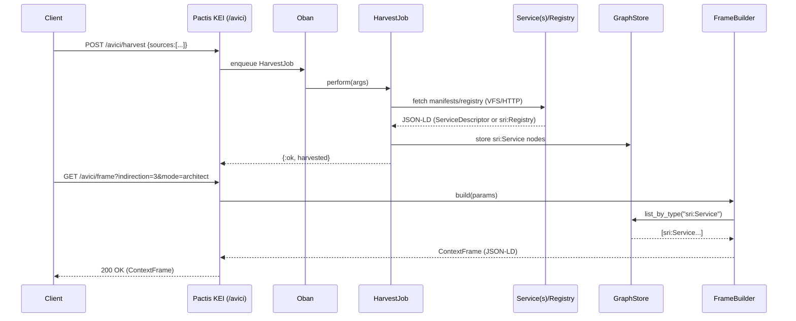

# Pactis System Diagrams

These diagrams provide a high-level view of Pactis components, interfaces, and data flows. Copy into blog posts or other docs as needed.

## System Overview
```mermaid
flowchart LR
  subgraph Clients
    U1[Human User]
    A1[Agent/LLM via LANG/LSP]
  end

  subgraph Pactis (Phoenix)
    SP[SpecAPI]
    KEI[KEI /avici (CFP)]
    SMI[SMI Billing (Oban)]
    CAI[CAI Content]
    SRI[SRI /service.jsonld]
    TAI[TAI Test API]
    LGI[LGI Logs/Telemetry]
    VFS[VFS graph:// cas:// git:// file://]
  end

  subgraph Data Plane
    GS[GraphStore (JSON-LD)]
    CAS[CAS Blobs]
    OB[Oban Queues\n:spec, :billing]
  end

  subgraph External
    EXT1[Service A\n/service.jsonld\n/openapi.json\n/healthz]
    EXT2[Service B\n/service.jsonld\n/openapi.json\n/healthz]
    REG[SRI Registry\nsri:Registry]
    KZ[Kyozo Store\nAI Memory]
  end

  U1 -->|UI/LiveViews| SP
  A1 <--> |LSP / Agents| SP

  %% Context Frame
  SP -->|Pre-enrich| KEI
  KEI -->|Build ContextFrame| GS
  KEI -->|Harvest & Read| GS

  %% Harvest
  KEI -->|POST /avici/harvest| OB
  OB -->|HarvestJob| EXT1
  OB -->|HarvestJob| EXT2
  OB -->|HarvestJob| REG
  OB -->|Store sri:Service| GS

  %% Content
  CAI -->|JSON-LD ↔ Markdown‑LD| VFS
  VFS --> GS
  VFS --> CAS

  %% Tests & Logs
  TAI -->|Submit/Run| GS
  LGI -->|Ingest| GS

  %% Billing
  SMI -->|Jobs| OB

  %% Memory / Sessions
  SP <--> KZ

  %% Discovery
  SRI -->|/service.jsonld (canonical)| EXT1
  SRI -->|aliases: /.well-known, /zpc/...| EXT1
```

## Harvest + Frame Build


## Notes
- Compact services: `GET /api/v1/avici/services?view=compact` returns id, name, aiSummary, capabilities, endpoints.
- Snapshot endpoint is deprecated (308) and redirects to the compact view.
- Harvest sources: `file://`, `git://`, `cas://` via VFS, and `http(s)://` via Req; expands `sri:Registry` docs to service URLs.
- Provenance: Patterns/Decisions accept `wasDerivedFrom` and store `prov:wasDerivedFrom`.
- SRI aliases: `/.well-known/pactis/service.jsonld` and `/zpc/avici/service` point to the same manifest as `/service.jsonld`.
