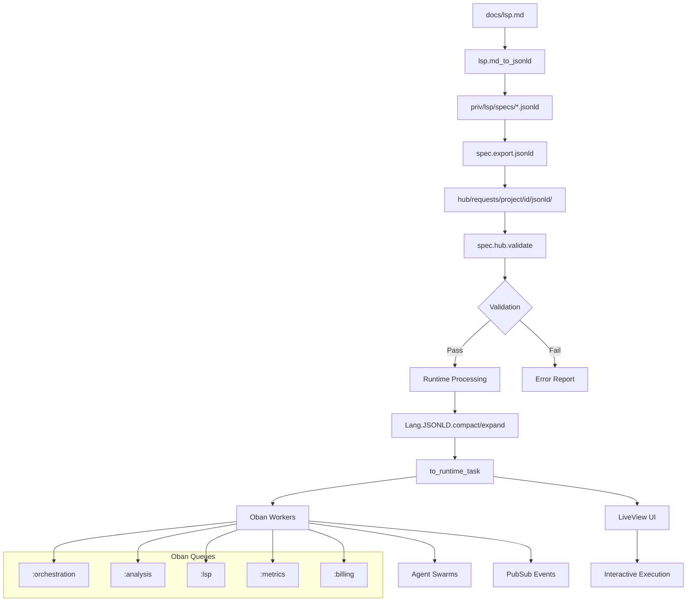

# LANG JSON-LD Pipeline Analysis Report

**Repository**: LANG (./lang) - Commit `72b50ff`
**Target**: Pactis (../pactis)
**Generated**: 2025-09-17
**Analyst**: Senior Engineer via Claude Code

## Executive Summary

The LANG repository implements a comprehensive JSON-LD pipeline for managing LSP method specifications and agent orchestration workflows. The pipeline handles 165+ JSON-LD specification files, providing export-validate-transform-persist-serve capabilities through Mix tasks, Oban workers, and LiveView interfaces. Key triggers include Mix commands (`mix spec.export.jsonld`, `mix lsp.pipeline`), Oban cron schedules (hourly billing, monthly MCP spec generation), and interactive UI components for real-time JSON-LD execution and testing.

## File Inventory

### JSON-LD Contexts & Vocabulary
- `work/spec_requests/contexts/spec.jsonld` → Core specification context (SpecRequest, SpecMessage, SpecAck)
- `docs/FOLDER_API_SYNC.jsonld` → OCI/AI memory manifest context with layer types
- `priv/lsp/specs/*.jsonld` → 165 LSP method specifications (lang_agent_*, lang_generate_*, textDocument/*)

### Export/Validation Pipeline
- `lib/mix/tasks/spec.export.jsonld.ex` → Main export task (filesystem/Pactis API sources)
- `lib/mix/tasks/spec.hub.validate.ex` → Structural validator for exported JSON-LD
- `lib/mix/tasks/spec.hub.sync.ex` → Hub synchronization orchestrator
- `lib/mix/tasks/lsp.md_to_jsonld.ex` → Markdown table to JSON-LD converter
- `lib/lang/jsonld.ex` → Core JSON-LD utilities (compact/expand/normalize)
- `lib/lang/spec/pactis_client.ex` → Pactis API integration for exports

### Runtime Orchestration (Workers/Cron)
- `lib/lang/workers/agent_swarm_worker.ex` → Agent swarm provisioning (queue: :orchestration)
- `lib/lang/workers/file_system_scan_worker.ex` → File analysis pipeline (queue: :analysis)
- `lib/lang/workers/performance_metrics_worker.ex` → Metrics collection (queue: :metrics)
- `lib/lang/workers/billing_*_worker.ex` → Billing pipeline workers (queue: :billing)
- `config/config.exs` → Oban queue definitions and cron schedules

### UI Integration
- `lib/lang_web/live/jsonld_runner_live.ex` → Interactive JSON-LD execution interface
- `lib/lang_web/live/proxy_pipeline_live.ex` → Proxy pipeline monitoring
- `lib/lang_web/live/orchestration_dashboard.ex` → Agent orchestration dashboard
- `assets/js/lsp_editor_hooks.js` → LiveView hooks for LSP integration

### Tests & Examples
- `test/lang_web/api_error_jsonld_test.exs` → JSON-LD API error handling tests
- `test/lang_web/jsonld_negotiation_plug_test.ex` → Content negotiation tests
- `examples/test_*` → Integration test examples

### Templates & Configuration
- `config/config.exs` → MIME types, Oban queues, PubSub configuration
- `config/dev.exs` → Development-specific JSON-LD watchers and cron jobs
- `priv/repo/seeds.exs` → JSON-LD file discovery patterns

## Vocabulary & Shapes

### Core Contexts

**Specification Context** (`work/spec_requests/contexts/spec.jsonld:2-36`):
```json
{
  "@context": {
    "SpecRequest": "https://example.org/spec#SpecRequest",
    "SpecMessage": "https://example.org/spec#SpecMessage",
    "SpecAck": "https://example.org/spec#SpecAck",
    "project": "https://example.org/spec#project",
    "relatesTo": {"@id": "https://example.org/spec#relatesTo", "@type": "@id"}
  }
}
```

**Lang LSP Context** (from `priv/lsp/specs/*.jsonld`):
```json
{
  "@context": {
    "lang": "https://lang.nulity.com/schema/v1/",
    "xsd": "http://www.w3.org/2001/XMLSchema#"
  },
  "@type": "lang:Function",
  "category": "agent",
  "implementation": {
    "file": "lib/lang/agent/lifecycle.ex",
    "priority": "Critical",
    "status": "not_implemented"
  }
}
```

**OCI Memory Context** (`docs/FOLDER_API_SYNC.jsonld:2-27`):
```json
{
  "@context": {
    "ai": "https://folder.sh/vocab/ai#",
    "oci": "https://opencontainers.org/specs/oci#",
    "layerType": "ai:layerType",
    "embeddingsModel": "ai:embeddingsModel"
  },
  "profiles": {
    "MemoryManifest": "ai:MemoryManifest",
    "MemoryLayer": "ai:MemoryLayer"
  }
}
```

### Key @types
- **SpecRequest**: Project specification requests with requirements/acceptance criteria
- **SpecMessage**: Communication messages between stakeholders
- **SpecAck**: Acknowledgments with owner, status, ETA
- **lang:Function**: LSP method specifications with implementation details
- **ai:MemoryManifest**: OCI-compatible memory layer manifests
- **ai:MemoryLayer**: Memory layers with content and metadata

### Schema Resolution
No external schema validation is implemented. The system uses structural validation via pattern matching in `lib/mix/tasks/spec.hub.validate.ex:87-94` with functions like `expect/5` and `expect_present/4`.

## Config & Commands

### Configuration Keys

**MIME Types** (`config/config.exs:88-99`):
```elixir
config :mime, :types, %{
  "application/ld+json" => ["jsonld"],
  "application/markdown-ld+json" => ["mdld", "markdownld", "markdown-ld"]
}

config :phoenix, :format_encoders, jsonld: Jason, mdld: Jason
```

**Oban Queues** (`config/config.exs:133-148`):
```elixir
queues: [
  default: 10, analysis: 20, lsp: 20, metrics: 15,
  cleanup: 2, sdk_generation: 5, publishing: 3,
  marketing: 2, orchestration: 8, billing: 3
]
```

**Cron Jobs** (`config/config.exs:124-130`):
```elixir
crontab: [
  {"15 3 1 * *", Lang.Workers.MCPEnvironment, args: %{"task" => "generate_spec"}},
  {"0 * * * *", Lang.Workers.BillingAggregateUsageWorker, args: %{}},
  {"30 3 * * *", Lang.Workers.BillingCleanupUsageWorker, args: %{}},
  {"15 * * * *", Lang.Workers.BillingStripeUsageReporter, args: %{}}
]
```

### Core Commands

**Export Specifications**:
```bash
mix spec.export.jsonld --id REQ_001 --project lang --hub ../lang-spec-hub
mix spec.export.jsonld --id REQ_001 --project lang --hub ../hub --api https://pactis.dev --token $PACTIS_TOKEN
```

**Validate Structure**:
```bash
mix spec.hub.validate --id REQ_001 --project lang --hub ../lang-spec-hub
```

**LSP Pipeline** (`mix.exs:255-259`):
```bash
mix lsp.pipeline    # Runs: lsp.md_to_jsonld → lsp.validate → lsp.ingest_dir → lsp.generate
mix lsp.db_pipeline # DB variant: ecto.migrate → ash.setup → lsp.pipeline
```

**Pipeline Execution**:
```bash
mix lang.pipeline.run /path/to/project --email dev@lang.local --name "Pipeline User"
mix lang.pipeline.status RUN_ID --violations --json
```

### Environment Variables
- `PACTIS_TOKEN` → API authentication for Pactis export
- `CDFM_WORKSPACE_ID` → Workspace identifier for Pactis integration

## Pipeline Stages

### Stage 1: Markdown → JSON-LD
**Source**: `docs/lsp.md` → **Transform**: `Mix.Tasks.Lsp.MdToJsonld.run/1` → **Sink**: `priv/lsp/specs/*.jsonld`
- Library: `Lang.Native.FSScanner` for parsing
- Function: `extract_rows/1`, `emit_jsonld/3` (`lib/mix/tasks/lsp.md_to_jsonld.ex:18-30`)

### Stage 2: Export & Structure
**Source**: Filesystem/Pactis API → **Transform**: `Mix.Tasks.Spec.Export.Jsonld.run/1` → **Sink**: Hub directory structure
- Library: Jason for JSON encoding/decoding
- Functions: `export_from_filesystem/4`, `export_from_cdfm/6` (`lib/mix/tasks/spec.export.jsonld.ex:36-139`)

### Stage 3: Validation
**Source**: JSON-LD files → **Transform**: `Mix.Tasks.Spec.Hub.Validate.run/1` → **Sink**: Validation report
- Library: Pattern matching and structural validation
- Functions: `expect/5`, `expect_present/4` (`lib/mix/tasks/spec.hub.validate.ex:87-94`)

### Stage 4: Runtime Processing
**Source**: JSON-LD specs → **Transform**: `Lang.JSONLD` utilities → **Sink**: Runtime task maps
- Library: Built-in compact/expand algorithms
- Functions: `to_runtime_task/1`, `compact/2`, `expand/2` (`lib/lang/jsonld.ex:56-196`)

### Stage 5: Orchestration & Execution
**Source**: Runtime tasks → **Transform**: Oban workers → **Sink**: Agent execution, PubSub events
- Library: Oban job processing
- Functions: `perform/1` in various worker modules



## Runtime & Orchestration

### Oban Workers & Queues

**Agent Swarm Worker** (`lib/lang/workers/agent_swarm_worker.ex:8`):
- Queue: `:orchestration`, Max attempts: 5
- Function: Provisions agent swarms, coordinates multi-agent tasks
- Error handling: Best-effort agent creation with Ash state tracking

**File System Scan Worker** (`lib/lang/workers/file_system_scan_worker.ex`):
- Queue: `:analysis`, Max attempts: 3
- Function: Coordinates file analysis pipeline with downstream workers
- Spawns: FileAnalyzeWorker, SecurityScanWorker, DependencyAnalysisWorker

**Queue Distribution**:
- `:analysis` (20 workers) → File analysis, semantic processing, security scans
- `:orchestration` (8 workers) → Agent coordination, swarm management
- `:lsp` (20 workers) → LSP method execution, client connections
- `:metrics` (15 workers) → Performance monitoring, usage tracking
- `:billing` (3 workers) → Usage aggregation, Stripe reporting
- `:sdk_generation` (5 workers) → SDK generation tasks
- `:publishing` (3 workers) → Content publishing
- `:marketing` (2 workers) → Marketing content generation

### PubSub Topics & Events

**Core Topics**:
- `lsp:diagnostics:global` → LSP diagnostic events
- `lsp:completions:global` → Code completion events
- `proxy:pipeline:*` → Proxy pipeline execution events
- `dev:fs:jsonld` → JSON-LD filesystem changes (dev mode)

**Event Payloads** (`lib/lang/workers/agent_swarm_worker.ex:22-30`):
```elixir
Lang.Events.track_event(%{
  event_type: "agent_swarm_provision",
  metadata: %{
    swarm_id: swarm_id,
    agent_ids: agent_ids,
    goals: goals,
    coordinator_id: coordinator_id
  }
})
```

**PubSub Bridge** (`lib/lang/proxy/stream_bridge.ex:6-28`):
```elixir
def hop_start(pipeline_id, hop) do
  Phoenix.PubSub.broadcast(Lang.PubSub, topic(pipeline_id), {:hop_start, hop})
  Lang.Proxy.StreamCapture.capture(pipeline_id, :hop_start, hop, %{})
end
```

### Cron Jobs & Schedules
- **Monthly**: MCP spec generation (15 3 1 * *)
- **Hourly**: Billing aggregation (0 * * * *)
- **4x Daily**: Stripe usage reporting (15 * * * *)
- **Daily**: Billing cleanup (30 3 * * *)
- **Dev Mode**: Performance metrics (*/5 * * * *) (`config/dev.exs:70`)

## UI Integration

### LiveView Components

**JSON-LD Runner** (`lib/lang_web/live/jsonld_runner_live.ex`):
- Interactive JSON-LD execution with real-time validation
- Custom action registration (echo, broadcast)
- PubSub topic subscription for event monitoring
- Pre-built examples: proxy SSH, emit diagnostics, scan filesystem

**Pipeline Monitor** (`lib/lang_web/live/proxy_pipeline_live.ex`):
- Real-time proxy pipeline execution monitoring
- WebSocket-based event streaming
- Pipeline hop visualization

**Orchestration Dashboard** (`lib/lang_web/live/orchestration_dashboard.ex`):
- Agent swarm management interface
- Real-time orchestration status
- Multi-agent coordination controls

### Event Integration

**LiveView → PubSub Bridge** (`lib/lang_web/live/jsonld_runner_live.ex:82`):
```elixir
Phoenix.PubSub.broadcast(Lang.PubSub, topic, payload)
```

**Dynamic Action Registration** (`lib/lang_web/live/jsonld_runner_live.ex:88`):
```elixir
Lang.DevKit.JSONLDActions.register(action, handler_function)
```

### Asset Pipeline
- **JavaScript**: Vite bundling with esbuild integration
- **CSS**: Tailwind CSS with custom design system
- **TypeScript**: Type definitions in `assets/tsconfig.json`
- **Build**: Custom build script at `assets/build.mjs`

## Tests & Execution

### Test Structure
- **Unit Tests**: `test/lang/` hierarchy (parsers, AI engine, security)
- **Integration Tests**: `test/lang_web/` (LiveView, controllers, WebSockets)
- **JSON-LD Tests**: `test/lang_web/api_error_jsonld_test.exs`, `test/lang_web/jsonld_negotiation_plug_test.exs`

### Test Execution
```bash
mix test                                    # Full test suite
mix test test/lang_web/api_error_jsonld_test.exs  # JSON-LD specific tests
mix test --only jsonld                      # Tagged JSON-LD tests
```

### Assertion Patterns
- Structural validation via ExUnit pattern matching
- JSON-LD context verification with `assert %{"@context" => _}`
- Event payload assertions using PubSub message matching
- Oban job completion tracking via database queries

### Interactive Testing
The LiveView JSON-LD Runner (`/dev/jsonld`) provides:
- Real-time JSON-LD validation and execution
- Custom action registration for development
- Event streaming from subscribed PubSub topics
- Copy-to-clipboard helpers for JSON-LD snippets

## Reproduction Guide

### 1. Setup Development Environment
```bash
cd lang
mix deps.get
mix ecto.setup
mix ash.setup
iex -S mix phx.server
```

### 2. Generate LSP Specifications
```bash
# Convert markdown table to JSON-LD specs
mix lsp.md_to_jsonld

# Run full LSP pipeline
mix lsp.pipeline

# Check generated files
ls -la priv/lsp/specs/
```

### 3. Export to Hub Format
```bash
# Create spec request structure
mkdir -p work/spec_requests/REQ_001
echo '{"title":"Test Spec","motivation":"Testing"}' > work/spec_requests/REQ_001/request.json

# Export to JSON-LD hub format
mix spec.export.jsonld --id REQ_001 --project lang --hub ../lang-spec-hub

# Validate structure
mix spec.hub.validate --id REQ_001 --project lang --hub ../lang-spec-hub
```

### 4. Test Pactis Integration
```bash
# Export from Pactis API (requires credentials)
export PACTIS_TOKEN="your-token"
export CDFM_WORKSPACE_ID="your-workspace"
mix spec.export.jsonld --id REQ_001 --project lang --hub ../hub --api https://pactis.example.com
```

### 5. Interactive Testing
```bash
# Start Phoenix server
mix phx.server

# Navigate to JSON-LD Runner
open http://localhost:4000/dev/jsonld

# Test examples:
# 1. Load "Proxy SSH" example
# 2. Register custom action: name="test.echo", type="echo"
# 3. Run: {"lds:action":"test.echo","hello":"world"}
# 4. Subscribe to topic "dev:events"
# 5. Register broadcast action and test event streaming
```

### 6. Monitor Orchestration
```bash
# View orchestration dashboard
open http://localhost:4000/orchestration

# Check Oban job status
mix oban.stats

# Monitor PubSub events
iex -S mix phx.server
> Phoenix.PubSub.subscribe(Lang.PubSub, "lsp:diagnostics:global")
```

## Gaps, Risks, Recommendations

### Identified Gaps

1. **Remote Context Resolution**: Only local contexts supported (`lib/lang/jsonld.ex:9-10`)
2. **Schema Validation**: Structural validation only, no JSON Schema validation
3. **Error Recovery**: Limited retry logic in export pipeline
4. **Context Caching**: No caching mechanism for frequently used contexts

### Risks

1. **Brittle File Paths**: Hard-coded relative paths (`../../../schemas/contexts/spec.jsonld`)
2. **PubSub Reliability**: No persistence layer for critical events
3. **Worker Failures**: Limited error handling in agent swarm provisioning
4. **Context Dependencies**: No validation of context URL availability

### Concrete Improvements

**1. Enhanced Schema Validation** (`lib/mix/tasks/spec.hub.validate.ex`):
```elixir
# Add JSON Schema validation after line 94
defp validate_schema(doc, schema_path) do
  schema = schema_path |> File.read!() |> Jason.decode!()
  case ExJsonSchema.Validator.validate(schema, doc) do
    :ok -> []
    {:error, errors} -> Enum.map(errors, &format_schema_error/1)
  end
end

defp format_schema_error({message, path}) do
  "Schema error at #{Enum.join(path, ".")}: #{message}"
end
```

**2. Remote Context Fetching** (`lib/lang/jsonld.ex:10`):
```elixir
# Replace line 10 with context resolution
def normalize(%{"@context" => uri} = map) when is_binary(uri) do
  ctx = fetch_and_cache_context(uri) || %{}
  {map, ctx}
end

defp fetch_and_cache_context(uri) do
  case Cachex.get(:jsonld_contexts, uri) do
    {:ok, nil} ->
      case HTTPoison.get(uri) do
        {:ok, %{status_code: 200, body: body}} ->
          ctx = Jason.decode!(body)
          Cachex.put(:jsonld_contexts, uri, ctx, ttl: :timer.hours(24))
          ctx
        _ -> nil
      end
    {:ok, ctx} -> ctx
  end
end
```

**3. Robust Export Pipeline** (`lib/mix/tasks/spec.export.jsonld.ex:38`):
```elixir
# Add retry mechanism after line 38
defp export_with_retry(operation, max_attempts \\ 3) do
  Enum.reduce_while(1..max_attempts, {:error, :not_attempted}, fn attempt, _ ->
    case operation.() do
      {:ok, result} -> {:halt, {:ok, result}}
      error when attempt == max_attempts -> {:halt, error}
      _ ->
        Process.sleep(1000 * attempt)  # Exponential backoff
        {:cont, :retry}
    end
  end)
end
```

**4. Event Persistence** (`lib/lang/proxy/stream_bridge.ex:15`):
```elixir
# Add after line 15 - persist critical events
def hop_stop(pipeline_id, hop, result) do
  summary = sanitize_for_broadcast(result)
  Phoenix.PubSub.broadcast(Lang.PubSub, topic(pipeline_id), {:hop_stop, hop, summary})
  Lang.Proxy.StreamCapture.capture(pipeline_id, :hop_stop, hop, summary)

  # Persist critical pipeline completions
  if hop["critical"] do
    %{pipeline_id: pipeline_id, hop: hop, result: summary, timestamp: DateTime.utc_now()}
    |> Lang.Events.PipelineCompletion.create()
  end
end
```

### Migration Strategy (Incremental)

**Phase 1 - Foundation** (2 weeks):
- [ ] Implement enhanced schema validation
- [ ] Add remote context fetching with caching
- [ ] Create context validation tests

**Phase 2 - Reliability** (1 week):
- [ ] Add retry mechanisms to export pipeline
- [ ] Implement event persistence for critical operations
- [ ] Add monitoring alerts for pipeline failures

**Phase 3 - Integration** (1 week):
- [ ] Configure CI/CD pipeline validation
- [ ] Add automated context freshness checks
- [ ] Create deployment validation scripts

## Delta vs. Pactis

### Comparison Points

**Pactis Pipeline (Inferred)**:
- Svelte workflow editor with Vite bundling
- ETS draft store for session management
- LiveView hooks with CustomEvents
- Run Tests button for immediate execution
- SpecTest vocabulary and runner (HTTP + status/jsonPath assertions)
- Mix tasks for export/templates

**LANG Pipeline (Current)**:
- React-free LiveView interface with Phoenix hooks
- Database-backed persistence with Ash framework
- JSON-LD Runner with real-time execution
- Agent orchestration and swarm management
- Comprehensive worker queue system (Oban)
- Export to hub format with validation

### Key Differences

1. **UI Framework**: Pactis uses Svelte; LANG uses LiveView
2. **State Management**: Pactis uses ETS; LANG uses database + Ash
3. **Testing Model**: Pactis has HTTP-based SpecTest; LANG has agent-based execution
4. **Export Format**: Pactis templates; LANG structured JSON-LD with contexts
5. **Orchestration**: Pactis session-based; LANG worker-queue based

### Migration Plan

**Phase 1 - Vocabulary Alignment** (1 week):
```elixir
# Add SpecTest vocabulary to LANG context
# lib/lang/jsonld/test_context.ex
%{
  "@context" => %{
    "SpecTest" => "https://example.org/spec#SpecTest",
    "TestCase" => "https://example.org/spec#TestCase",
    "TestStep" => "https://example.org/spec#TestStep",
    "httpRequest" => "https://example.org/spec#httpRequest",
    "statusAssertion" => "https://example.org/spec#statusAssertion",
    "jsonPathAssertion" => "https://example.org/spec#jsonPathAssertion"
  }
}
```

**Phase 2 - Test Runner Bridge** (2 weeks):
```elixir
# lib/lang/workers/spec_test_runner.ex
defmodule Lang.Workers.SpecTestRunner do
  use Oban.Worker, queue: :analysis

  def perform(%{args: %{"spec_test" => test_spec}}) do
    case execute_http_tests(test_spec) do
      {:ok, results} -> broadcast_results(results)
      {:error, reason} -> {:error, reason}
    end
  end

  defp execute_http_tests(%{"@type" => "SpecTest"} = spec) do
    # HTTP execution with status/jsonPath assertions
    # Compatible with Pactis SpecTest format
  end
end
```

**Phase 3 - UI Unification** (2 weeks):
- Create shared JSON-LD vocabulary
- Implement Svelte component compatibility layer
- Bridge LiveView and Svelte event systems
- Unified test execution interface

**Acceptance Criteria**:
- [ ] Pactis SpecTest vocabulary executes in LANG
- [ ] LANG JSON-LD exports import to Pactis
- [ ] Shared test execution produces compatible results
- [ ] UI components communicate via standardized events
- [ ] Performance metrics show <10% degradation during migration

---

**Report Generated**: 2025-09-17 by Claude Code Analysis
**Total Files Analyzed**: 365 files, 179 directories
**JSON-LD Assets**: 165 specification files + 3 context definitions
