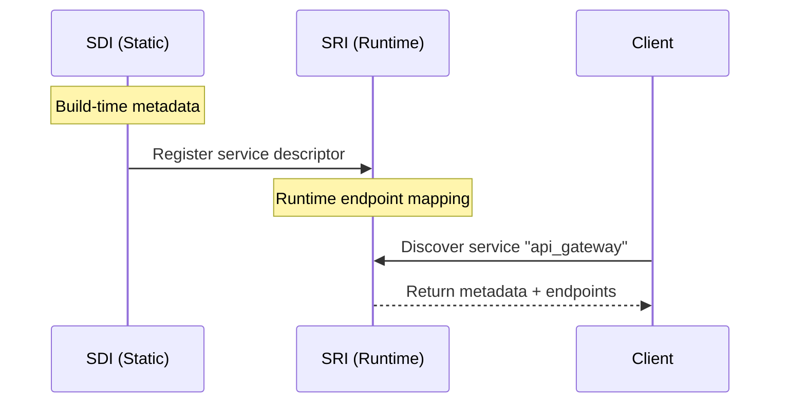

# Pactis‑SDI Integration Guide

## Overview
This guide describes how the Service Self-Description Interface (Pactis‑SDI) integrates with existing Pactis specifications, PromptOps automation, and service mesh infrastructure.

## Integration Architecture

```
┌────────────────────────────────────────────────────────────────┐
│                    Service Mesh Platform                        │
│  ┌──────────────┐  ┌──────────────┐  ┌──────────────┐         │
│  │   PromptOps  │  │   CI/CD      │  │  Monitoring  │         │
│  │   Automation │  │   Pipeline   │  │  Dashboard   │         │
│  └──────┬───────┘  └──────┬───────┘  └──────┬───────┘         │
│         │                  │                  │                 │
│  ┌──────▼──────────────────▼──────────────────▼───────┐        │
│  │            Pactis Framework Layer                   │        │
│  │  ┌─────────┐ ┌─────────┐ ┌─────────┐ ┌─────────┐  │        │
│  │  │   SDI   │ │   SMI   │ │   SRI   │ │   API   │  │        │
│  │  └─────────┘ └─────────┘ └─────────┘ └─────────┘  │        │
│  └─────────────────────────────────────────────────────┘        │
│                            │                                    │
│  ┌─────────────────────────▼────────────────────────┐          │
│  │              Service Repositories                 │          │
│  │  ┌──────────┐  ┌──────────┐  ┌──────────┐       │          │
│  │  │ Service A│  │ Service B│  │ Service C│       │          │
│  │  │ ✓ SDI    │  │ ✓ SDI    │  │ ✗ No SDI │       │          │
│  │  └──────────┘  └──────────┘  └──────────┘       │          │
│  └───────────────────────────────────────────────────┘          │
└────────────────────────────────────────────────────────────────┘
```

## Interface Interactions

### SDI ↔ SMI (Settlement & Metering)
Service metadata from SDI informs metering configuration in SMI:

```json
{
  "@type": "pactis:ServiceDescriptor",
  "@id": "pactis:services/api_gateway",
  "pactis:capabilities": ["pactis:capability/rest-api"],
  "pactis:metering": {
    "@type": "pactis:MeteringConfig",
    "pactis:eventTypes": ["api_call", "data_transfer"],
    "pactis:ratingRule": "pactis:rules/api_tiered"
  }
}
```

Flow:
1. SDI declares service capabilities and metering hints
2. SMI uses metadata to configure usage tracking
3. Settlement system bills based on declared event types

### SDI ↔ SRI (Service Registry)
SDI provides static metadata, SRI manages runtime discovery:



### SDI ↔ API (Artifact Publication)
Service metadata becomes an artifact through the API interface:

```python
# Service metadata as Pactis artifact
metadata = discover_service_metadata(repo_path)
artifact_pointer = pactis_api.publish(
    source_type="service_descriptor",
    content=metadata,
    generator="pactis-sdi-v1"
)
```

### SDI ↔ TVI (Truth Validation)
Service metadata validation uses TVI error taxonomy:

```json
{
  "@type": "pactis:ValidationReport",
  "pactis:source": "pactis:services/frontend",
  "pactis:errors": [
    {
      "code": "SDI-001",
      "severity": "error",
      "path": "$.dependencies[0]",
      "message": "Dependency 'pactis:services/unknown' not found"
    }
  ]
}
```

## PromptOps Integration

### Fallback Generation Flow
When SDI doesn't find self-description, PromptOps generates it:

```yaml
# prompts/services/generate-jsonld-v2.md
Process:
  1. Check SDI discovery locations
  2. If not found:
     - Analyze repository with Claude
     - Generate ServiceDescriptor
     - Mark with pactis:autoGenerated
  3. Create suggested file
  4. Report to platform
```

### Automation Pipeline
```makefile
# Makefile integration
check-sdi:
	@for repo in $(REPOS); do \
		pactis-sdi discover $$repo || \
		promptops generate-sdi $$repo; \
	done

validate-sdi:
	pactis-tvi validate --profile sdi ./services/*.jsonld

publish-sdi:
	pactis-api publish --type service-descriptor ./services/*.jsonld
```

## Implementation Patterns

### Pattern 1: Repository Self-Description
```bash
# In repository root
mkdir -p .well-known
cat > .well-known/service.jsonld << EOF
{
  "@context": ["https://schema.org", "https://pactis.dev/vocab#"],
  "@type": ["pactis:ServiceDescriptor", "schema:SoftwareApplication"],
  "@id": "pactis:services/$(basename $PWD)",
  "schema:name": "$(basename $PWD)",
  "schema:description": "Service description",
  "schema:version": "1.0.0"
}
EOF
```

### Pattern 2: CI/CD Validation
```yaml
# .github/workflows/sdi-validation.yml
name: SDI Validation
on: [push]
jobs:
  validate:
    runs-on: ubuntu-latest
    steps:
      - uses: actions/checkout@v2
      - name: Validate SDI metadata
        run: |
          pactis-sdi validate .well-known/service.jsonld
      - name: Publish to registry
        if: github.ref == 'refs/heads/main'
        run: |
          pactis-api publish \
            --source .well-known/service.jsonld \
            --type service-descriptor
```

### Pattern 3: Service Mesh Discovery
```elixir
# Elixir implementation using SDI
defmodule ServiceMesh.Discovery do
  use Pactis.SDI

  def discover_topology do
    services = Pactis.SDI.discover_all(repositories())

    services
    |> validate_metadata()
    |> build_dependency_graph()
    |> detect_circular_dependencies()
    |> generate_topology_map()
  end

  defp validate_metadata(services) do
    Enum.map(services, &Pactis.TVI.validate(&1, :sdi))
  end
end
```

## Migration Strategy

### Phase 1: Coexistence (Current)
- SDI discovery with PromptOps fallback
- Both self-described and generated metadata accepted
- Validation warnings only

### Phase 2: Encouragement
- CI/CD templates with SDI validation
- Metrics dashboard showing adoption
- Generated metadata marked clearly

### Phase 3: Enforcement
- SDI validation required in CI/CD
- No fallback generation in production
- Full conformance required

## Monitoring & Observability

### SDI Metrics
```json
{
  "sdi_metrics": {
    "total_services": 42,
    "self_described": 28,
    "auto_generated": 14,
    "adoption_rate": 0.67,
    "validation_failures": 3,
    "average_metadata_size": 2048,
    "last_discovery_run": "2025-01-15T10:00:00Z"
  }
}
```

### Event Stream
```json
{
  "@type": "pactis:SDIEvent",
  "pactis:eventType": "discovery_completed",
  "pactis:service": "pactis:services/frontend",
  "pactis:source": "repository",
  "pactis:valid": true,
  "pactis:timestamp": "2025-01-15T10:00:00Z"
}
```

## Security Considerations

### Metadata Verification
```python
def verify_service_metadata(metadata: dict) -> bool:
    """Verify SDI metadata provenance."""
    if "proof" not in metadata:
        return False

    return pactis.verify_signature(
        document=metadata,
        proof=metadata["proof"],
        purpose="assertionMethod"
    )
```

### Access Control
```yaml
# SDI access policy
policy:
  read:
    - role: developer
    - role: ci_system
  write:
    - role: service_owner
    - role: platform_admin
  validate:
    - role: ci_system
    - role: platform_admin
```

## Troubleshooting

### Common Issues

1. **Metadata Not Found**
   - Check discovery locations in priority order
   - Verify file permissions
   - Ensure valid JSON-LD syntax

2. **Validation Failures**
   - Check required fields
   - Validate URLs are reachable
   - Verify semantic version format

3. **Circular Dependencies**
   - Review service relationships
   - Use dependency visualization tools
   - Break cycles at appropriate boundaries

## Reference Implementation

Available at: https://github.com/pactis/pactis-sdi

```bash
# Install SDI tools
npm install -g @pactis/sdi-cli

# Discover service metadata
pactis-sdi discover ./my-service

# Validate metadata
pactis-sdi validate .well-known/service.jsonld

# Generate metadata (bootstrap)
pactis-sdi init

# Aggregate multiple services
pactis-sdi aggregate ./services --output topology.json
```

## Conclusion

Pactis‑SDI provides the foundation for service mesh metadata management by:
- Enabling services to self-describe their capabilities
- Integrating with existing Pactis specifications
- Supporting gradual migration through PromptOps fallback
- Building toward fully automated service discovery

The combination of SDI with other Pactis interfaces creates a comprehensive platform for service mesh management with negotiated truth and provenance guarantees.

---
*Pactis‑SDI Integration Guide v1.0*
