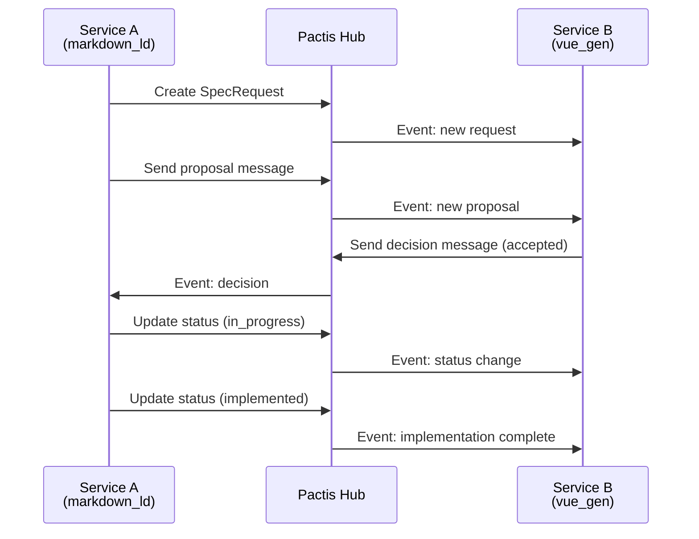
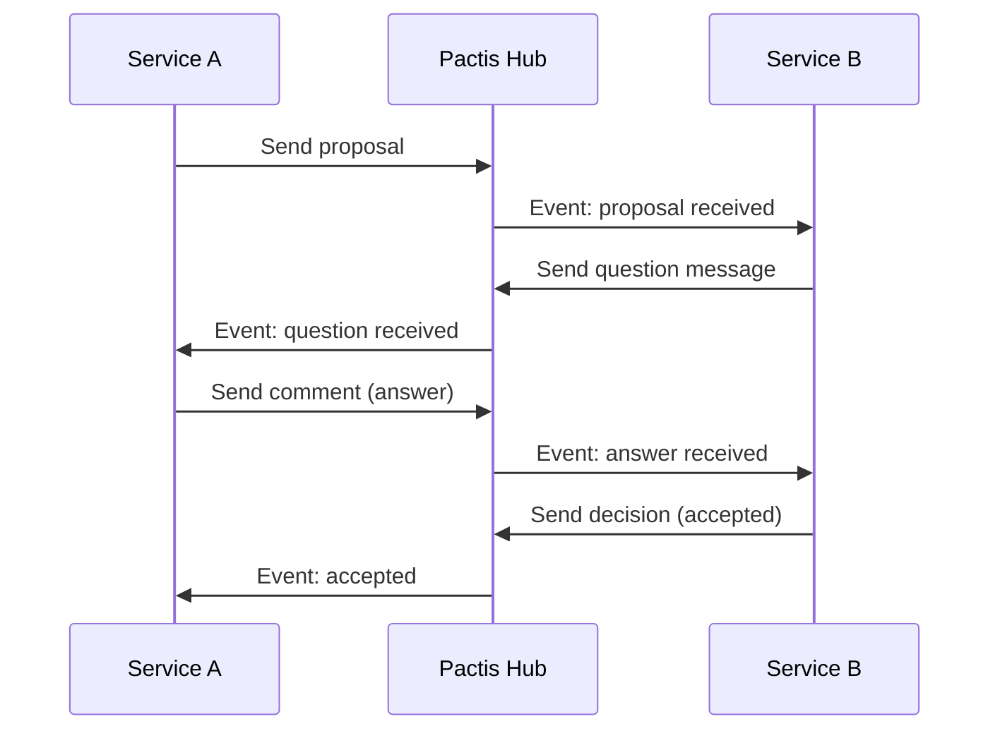
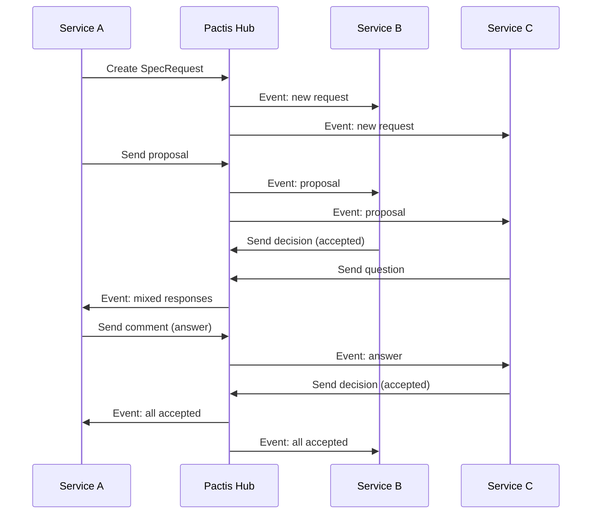

# Negotiation Protocol & Message Flows

## Protocol Overview

The Pactis Cross-Repository Negotiation Protocol enables structured communication between distributed services to coordinate specification changes. The protocol defines message types, state transitions, and interaction patterns that ensure reliable coordination without tight coupling.

## Message Flow Patterns

### 1. Simple Proposal Flow



### 2. Question & Answer Flow



### 3. Multi-Service Coordination



## State Transition Rules

### Request Status Flow
```
proposed → accepted → in_progress → implemented
    ↓         ↓            ↓
 rejected   blocked     blocked
```

**Transition Rules:**
- `proposed` → `accepted`: Requires explicit decision message
- `proposed` → `rejected`: Can happen at any time with justification
- `accepted` → `in_progress`: Indicates implementation started
- `accepted` → `blocked`: External dependencies preventing progress
- `in_progress` → `implemented`: Implementation complete
- `in_progress` → `blocked`: Implementation hit obstacles
- `blocked` → `in_progress`: Obstacles resolved
- Any status → `rejected`: Can be rejected with proper notification

### Message Type Interactions

| Current State | Allowed Message Types | Next Actions |
|---------------|----------------------|--------------|
| `proposed` | comment, question, proposal, decision | Accept, reject, or request clarification |
| `accepted` | comment, question | Move to in_progress or block |
| `in_progress` | comment, question | Complete or block |
| `implemented` | comment | Archive or create follow-up |
| `rejected` | comment | Create new request if needed |
| `blocked` | comment, question, proposal | Resolve blockers |

## Communication Patterns

### 1. Broadcast Notification
When a service creates a request or sends a message, all subscribed services receive notifications.

```json
{
  "pattern": "broadcast",
  "trigger": "new_message",
  "recipients": "all_workspace_subscribers",
  "delivery": "real_time_pubsub"
}
```

### 2. Pull-Based Synchronization
Services can poll for updates since a specific timestamp, enabling catch-up after downtime.

```http
GET /requests/{id}/messages?since=2025-09-01T15:00:00Z
```

### 3. Export-Based Integration
Services can export the entire negotiation history as JSON-LD for analysis or archival.

```http
GET /requests/{id}/export.jsonld
Accept: application/ld+json
```

## Interaction Semantics

### Message Types & Purposes

#### `comment`
- **Purpose**: General discussion, clarification, updates
- **Response**: Optional
- **Example**: "Implementation is 50% complete, targeting Friday delivery"

#### `question`  
- **Purpose**: Request specific information or clarification
- **Response**: Expected (comment or another question)
- **Example**: "What's the migration path for existing v1.x clients?"

#### `proposal`
- **Purpose**: Suggest specific changes with details
- **Response**: Decision expected
- **Example**: "Add backward compatibility layer with deprecation timeline"
- **Attachments**: Often includes patches, configs, documentation

#### `decision`
- **Purpose**: Accept, reject, or conditionally approve proposals
- **Response**: Status update expected
- **Example**: "Accepted with modification: extend deprecation to 6 months"

### Reference System
Messages can reference specific files and locations:

```json
{
  "ref": {
    "path": "schemas/core.jsonld",
    "json_pointer": "/definitions/Entity/properties/id"
  }
}
```

This enables precise discussions about specific code/config sections.

### Attachment Handling
- **Supported Types**: Any file format (patches, docs, configs, images)
- **Size Limits**: 2MB total per message
- **Storage**: Content-addressable with SHA256 deduplication
- **Security**: Path traversal protection, virus scanning

## Error Handling & Recovery

### Network Failures
- **Idempotency Keys**: Prevent duplicate messages during retries
- **Event Replay**: Services can replay missed events from timestamps
- **Graceful Degradation**: Polling fallback when PubSub unavailable

### Conflict Resolution
- **Message Ordering**: Timestamps resolve ordering conflicts
- **Status Conflicts**: Last writer wins with audit trail
- **Workspace Isolation**: Prevents cross-tenant conflicts

### Timeout Handling
- **Question Timeout**: Questions without responses after 7 days get reminder
- **Implementation Timeout**: In-progress items without updates get status check
- **Blocked Resolution**: Blocked items reviewed weekly for resolution

## Protocol Extensions

### Custom Message Types
Services can propose new message types by extending the schema:

```json
{
  "type": "custom:performance_impact",
  "from": {"project": "metrics_service", "agent": "perf_analyzer"},
  "body": "Analyzed performance impact of proposed changes",
  "metadata": {
    "impact_score": 0.15,
    "affected_endpoints": ["POST /api/v1/specs", "GET /api/v1/export"]
  }
}
```

### Workflow Integration
The protocol integrates with CI/CD and project management:
- **GitHub Integration**: Auto-create issues from questions
- **Slack Notifications**: Real-time team updates  
- **Metrics Collection**: Track negotiation velocity and bottlenecks

This protocol design enables sophisticated distributed coordination while maintaining simplicity and extensibility.