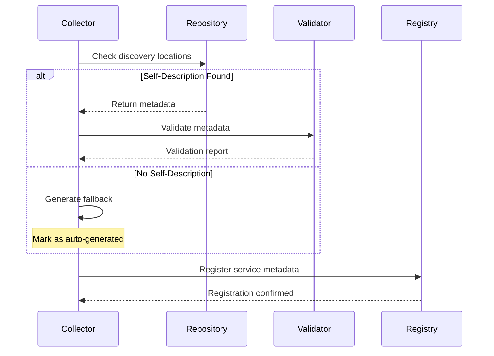

# Pactis‑SDI: Service Self-Description Interface

- Status: Draft
- Last Updated: 2025-09-25
- Owners: Pactis Core, ZPC Platform Team
- Related: Pactis-SMI.md, SERVICE-SELF-DESCRIPTION-SPEC.md, PROMPTOPS-SPEC.md
- Notice: Pactis™ is an open specification by Pactis and is not affiliated with any other entity using similar names. ™ indicates an unregistered trademark claim.

## Summary
Pactis‑SDI specifies a standardized interface for service self-description, enabling repositories and services to declare their metadata, capabilities, dependencies, and operational characteristics using JSON‑LD. This specification defines discovery protocols, vocabulary, validation requirements, and aggregation mechanisms for building a comprehensive service mesh metadata layer.

## Motivation
- Enable services to self-describe without external analysis or inference.
- Reduce dependency on AI/LLM-based code analysis for service discovery.
- Establish a single source of truth for service metadata within repositories.
- Support automated service mesh topology generation and dependency tracking.
- Provide standardized discovery locations following RFC 5785 (Well-Known URIs).
- Integrate with existing Pactis validation and provenance mechanisms.

## Non‑Goals
- Implementing service orchestration or runtime discovery protocols.
- Defining service communication patterns or transport layers.
- Building service registries or catalogs (implementation concern).
- Enforcing specific development methodologies or practices.

## Design Overview
SDI defines canonical locations and formats for service self-description metadata within code repositories. Services publish JSON‑LD documents at well-known locations, which can be discovered, validated, and aggregated by platform tools. When self-description is absent, fallback generation mechanisms provide compatibility.

### Layering Model
```
┌─────────────────────────────────────┐
│         Application Layer            │
│  (Service Mesh, PromptOps, CI/CD)    │
├─────────────────────────────────────┤
│      Pactis‑SDI (This Spec)         │
│  (Discovery, Validation, Aggregation)│
├─────────────────────────────────────┤
│        Pactis Framework              │
│   (JSON-LD, Validation, Provenance)  │
├─────────────────────────────────────┤
│       Repository Filesystem          │
│    (Git, Version Control, Storage)   │
└─────────────────────────────────────┘
```

## Vocabulary & JSON‑LD Shapes

### Base Context
```json
{
  "@context": {
    "pactis": "https://pactis.dev/vocab#",
    "schema": "https://schema.org/",
    "prov": "http://www.w3.org/ns/prov#",
    "doap": "http://usefulinc.com/ns/doap#",
    "xsd": "http://www.w3.org/2001/XMLSchema#"
  }
}
```

### ServiceDescriptor
- Type: `pactis:ServiceDescriptor` (extends `schema:SoftwareApplication`)
- Required: `@context`, `@type`, `@id`, `schema:name`, `schema:description`, `schema:version`
- Optional: `schema:url`, `schema:codeRepository`, `schema:applicationCategory`, `schema:programmingLanguage`, `pactis:parent`, `pactis:capabilities`, `pactis:dependencies`

Canonical form:
```json
{
  "@context": {
    "pactis": "https://pactis.dev/vocab#",
    "schema": "https://schema.org/"
  },
  "@id": "pactis:services/kyozo_store",
  "@type": ["pactis:ServiceDescriptor", "schema:SoftwareApplication"],
  "schema:name": "Kyozo Store",
  "schema:description": "Elixir-powered store engine for managing application data",
  "schema:version": "1.0.0",
  "schema:url": "https://kyozo.store",
  "schema:codeRepository": "https://github.com/zpc-sh/kyozo_store",
  "schema:applicationCategory": "DatabaseApplication",
  "schema:programmingLanguage": ["Elixir", "JavaScript"],
  "pactis:capabilities": [
    "pactis:capability/data-storage",
    "pactis:capability/rest-api",
    "pactis:capability/real-time"
  ],
  "pactis:dependencies": [
    {"@id": "pactis:services/auth_service"},
    {"@id": "pactis:services/message_queue"}
  ],
  "pactis:metadata": {
    "autoGenerated": false,
    "schemaVersion": "1.0",
    "lastUpdated": "2025-01-15T10:00:00Z"
  }
}
```

### ServiceCapability
- Type: `pactis:ServiceCapability`
- Fields: `@id`, `pactis:name`, `pactis:type`, `schema:description`

Example capabilities vocabulary:
```
pactis:capability/data-storage
pactis:capability/authentication
pactis:capability/message-queue
pactis:capability/rest-api
pactis:capability/graphql-api
pactis:capability/real-time
pactis:capability/batch-processing
```

### ServiceRelationship
- Type: `pactis:ServiceRelationship`
- Fields: `pactis:parent`, `pactis:dependencies`, `pactis:provides`, `pactis:consumes`

## Discovery Protocol

### Priority-Based Location Discovery
Services MUST be checked for self-description in the following priority order:

1. **RFC 5785 Well-Known URI**: `/.well-known/service.jsonld`
2. **Hidden Service Directory**: `/.service/metadata.json`
3. **Root Level**: `/service.jsonld`
4. **Package Manifests** (language-specific):
   - Node.js: `/package.json` → `serviceMetadata` field
   - Rust: `/Cargo.toml` → `[package.metadata.service]`
   - Elixir: `/mix.exs` → `service_metadata` key
   - Python: `/pyproject.toml` → `[tool.service]`
   - Go: `/service.yaml` or `/service.json`
5. **Container Metadata**:
   - `/Dockerfile` → `LABEL pactis.service.metadata`
   - `/docker-compose.yml` → `x-service-metadata`

### HTTP Discovery Endpoints (Platform)
- Repo SDI descriptor via RSI route: `GET /api/v1/repos/:owner/:repo/service.jsonld`
  - Applies the same priority resolution on the server side and returns the JSON‑LD found in the repository.
- See also: Pactis‑RSI for the repository manifest at `GET /api/v1/repos/:owner/:repo/manifest.jsonld`.

### Discovery Algorithm (Normative)
```python
def discover_service_metadata(repo_path: Path) -> Optional[Dict]:
    """
    Discover service metadata following Pactis-SDI protocol.
    Returns None if no self-description found.
    """
    # Priority 1: Well-Known URI
    if (repo_path / ".well-known" / "service.jsonld").exists():
        return load_jsonld(repo_path / ".well-known" / "service.jsonld")

    # Priority 2: Service Directory
    if (repo_path / ".service" / "metadata.json").exists():
        return load_json(repo_path / ".service" / "metadata.json")

    # Priority 3: Root Level
    if (repo_path / "service.jsonld").exists():
        return load_jsonld(repo_path / "service.jsonld")

    # Priority 4: Package Manifests
    metadata = extract_from_package_manifest(repo_path)
    if metadata:
        return metadata

    # Priority 5: Container Metadata
    metadata = extract_from_container_metadata(repo_path)
    if metadata:
        return metadata

    return None  # No self-description found
```

## Validation Requirements

### Structural Validation (MUST)
- Valid JSON-LD syntax per JSON-LD 1.1 specification
- Required fields present and non-empty
- Valid URLs for `schema:url` and `schema:codeRepository`
- Semantic version format for `schema:version`
- ISO 8601 datetime for temporal fields

### Semantic Validation (SHOULD)
- Service ID matches repository name pattern
- Programming languages align with repository content
- Dependencies reference valid service IDs
- Capabilities use standardized vocabulary terms

### Conformance Levels
1. **Minimal**: Only required fields with valid syntax
2. **Standard**: All recommended fields with semantic validation
3. **Complete**: Full metadata including capabilities and relationships

## Aggregation & Collection

### Collection Process


### Fallback Generation
When no self-description is found, implementations MAY generate metadata by:
1. Analyzing repository structure and content
2. Extracting from README and documentation
3. Inferring from package dependencies
4. Marking result with `"pactis:autoGenerated": true`

Generated metadata SHOULD create a suggested file at:
`/.well-known/service.jsonld.suggested`

## Implementation Requirements

### Repository Requirements (MUST)
- Provide valid JSON-LD at one of the specified locations
- Include all required fields
- Update metadata when service characteristics change

### Platform Requirements (MUST)
- Check all discovery locations in priority order
- Validate discovered metadata
- Support fallback generation for compatibility
- Report validation errors with clear remediation

### Tooling Requirements (SHOULD)
- Provide bootstrap utilities for initial metadata creation
- Support incremental metadata updates
- Integrate with CI/CD for validation
- Offer migration tools for existing services

## Integration with Pactis Framework

### Validation Integration
SDI metadata validation uses Pactis validation tiers:
1. **Syntax**: JSON-LD structural validation
2. **Schema**: Required fields and type checking
3. **Policy**: Organization-specific rules and constraints

### Provenance Integration
Service metadata MAY be signed using Pactis provenance:
```json
{
  "@context": ["https://w3id.org/security/v2", "..."],
  "@id": "pactis:services/kyozo_store",
  "...": "...",
  "proof": {
    "@type": "Ed25519Signature2020",
    "created": "2025-01-15T10:00:00Z",
    "verificationMethod": "did:key:z6MkhaXgBZDvotDkL5257faiztiGiC2QtKLGpbnnEGta2doK",
    "proofPurpose": "assertionMethod",
    "proofValue": "..."
  }
}
```

### Settlement Integration (Future)
Service metadata MAY include metering hints for Pactis-SMI:
```json
{
  "pactis:metering": {
    "eventTypes": ["api_call", "data_transfer"],
    "rateLimit": "1000/hour",
    "tier": "standard"
  }
}
```

## Security Considerations

### Metadata Tampering
- Repositories SHOULD sign metadata using Pactis provenance
- Collectors MUST validate signatures when present
- Changes SHOULD be tracked through version control

### Information Disclosure
- Metadata SHOULD NOT contain secrets or credentials
- Internal service names MAY be aliased for external consumption
- Private repositories MAY restrict metadata visibility

### Supply Chain Security
- Generated metadata MUST be marked as auto-generated
- Manual review SHOULD be required for generated metadata
- Dependency chains MUST be validated for circular references

## Migration Path

### Phase 1: Voluntary Adoption (Current)
- Documentation and tooling available
- Early adopters self-describe
- Fallback generation for others

### Phase 2: Recommended Practice
- CI/CD integration templates
- Validation in pull requests
- Metrics on adoption rate

### Phase 3: Required Conformance
- All services MUST self-describe
- No fallback generation
- Full validation enforcement

## Conformance

### Test Vectors
Implementations MUST correctly handle these test cases:

1. **Valid Minimal Metadata**
```json
{
  "@context": "https://schema.org",
  "@type": "SoftwareApplication",
  "@id": "test_service",
  "name": "Test Service",
  "description": "A test service",
  "version": "1.0.0"
}
```

2. **Invalid Missing Required Field**
```json
{
  "@context": "https://schema.org",
  "@type": "SoftwareApplication",
  "@id": "test_service",
  "name": "Test Service"
}
```
Expected: Validation error - missing required field 'description'

3. **Complete with Relationships**
```json
{
  "@context": {
    "schema": "https://schema.org/",
    "pactis": "https://pactis.dev/vocab#"
  },
  "@id": "pactis:services/frontend",
  "@type": ["pactis:ServiceDescriptor", "schema:SoftwareApplication"],
  "schema:name": "Frontend Service",
  "schema:description": "Web frontend application",
  "schema:version": "2.0.0",
  "pactis:dependencies": [
    {"@id": "pactis:services/api"},
    {"@id": "pactis:services/auth"}
  ]
}
```

### Implementation Checklist
- [ ] Discovery protocol implementation
- [ ] JSON-LD validation
- [ ] Fallback generation
- [ ] Error reporting
- [ ] Metrics collection
- [ ] Documentation

## References

### Normative
- [RFC 5785] M. Nottingham, E. Hammer-Lahav, "Defining Well-Known Uniform Resource Identifiers (URIs)", April 2010
- [JSON-LD 1.1] W3C Recommendation, "JSON-LD 1.1", July 2020
- [Schema.org] Schema.org Vocabulary, "SoftwareApplication"
- [RFC 2119] S. Bradner, "Key words for use in RFCs to Indicate Requirement Levels", March 1997

### Informative
- SERVICE-SELF-DESCRIPTION-SPEC.md
- PROMPTOPS-SPEC.md
- Pactis Framework Specification
- Pactis-SMI Settlement Interface

## Appendix A: Bootstrap Script Template

```bash
#!/bin/bash
# Bootstrap service self-description
mkdir -p .well-known
cat > .well-known/service.jsonld << 'EOF'
{
  "@context": {
    "schema": "https://schema.org/",
    "pactis": "https://pactis.dev/vocab#"
  },
  "@id": "pactis:services/$(basename $PWD)",
  "@type": ["pactis:ServiceDescriptor", "schema:SoftwareApplication"],
  "schema:name": "Service Name",
  "schema:description": "Service description",
  "schema:version": "1.0.0",
  "pactis:metadata": {
    "autoGenerated": false,
    "schemaVersion": "1.0",
    "lastUpdated": "$(date -u +%Y-%m-%dT%H:%M:%SZ)"
  }
}
EOF
echo "Created .well-known/service.jsonld"
```

## Appendix B: Language-Specific Examples

### Node.js (package.json)
```json
{
  "name": "my-service",
  "version": "1.0.0",
  "pactis": {
    "serviceMetadata": {
      "@context": "https://schema.org",
      "@type": "SoftwareApplication",
      "@id": "my_service",
      "name": "My Service",
      "description": "Node.js service"
    }
  }
}
```

### Rust (Cargo.toml)
```toml
[package]
name = "my-service"
version = "1.0.0"

[package.metadata.pactis]
"@context" = "https://schema.org"
"@type" = "SoftwareApplication"
"@id" = "my_service"
name = "My Service"
description = "Rust service"
```

### Elixir (mix.exs)
```elixir
def project do
  [
    app: :my_service,
    version: "1.0.0",
    pactis_metadata: %{
      "@context" => "https://schema.org",
      "@type" => "SoftwareApplication",
      "@id" => "my_service",
      "name" => "My Service",
      "description" => "Elixir service"
    }
  ]
end
```

---
*End of Pactis‑SDI Specification v1.0*
